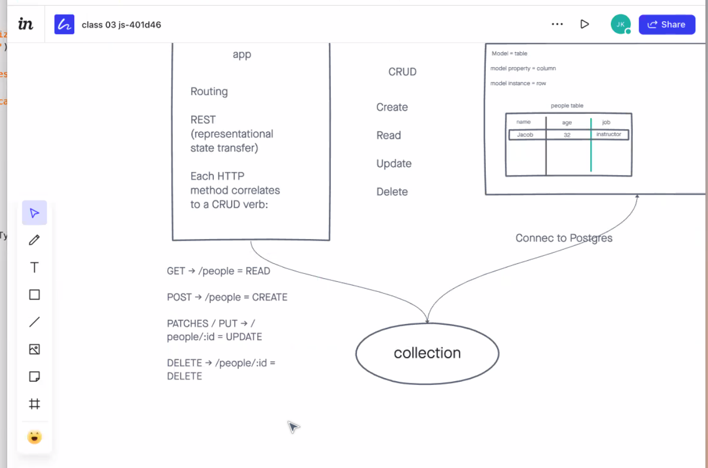

# Basic-API-Server

As the name suggest, this is a **B**asic **A**PI **S**erver! We built this app in code 401 as a means of practicing getting an Express server up and running. 
PR links can be found at the bottom of this document[^1]

[GitHub Repo](https://github.com/AndresMillsGallego/basic-api-server)

[Heroku Deployed Link]()

## Installation

To install this app just follow these steps:

- Clone down this repo
- CD into your new directory
- npm install

And that is it!

[Docs](https://sequelize.org/)

## Usage

A good introduction to the inner workings of sequelize, postgres and how to create and use the database.

## Contributors / Authors

Project by: Andres Mills Gallego

[My GitHub](https://github.com/AndresMillsGallego)

[My LinkedIn](https://www.linkedin.com/in/andres-mills-gallego/)

## Features / Routes

I used `sequelize`, `postgres`, `express`, `jest` to build and test this app.  It is a **REST** app and uses `GET`, `PUT`, `POST` and `DELETE` routes.  These are all used in separate Router files for each model.

## Pull Requests

[^1]: [Class 03 Pull Request]()